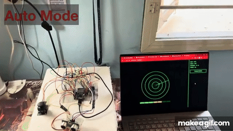
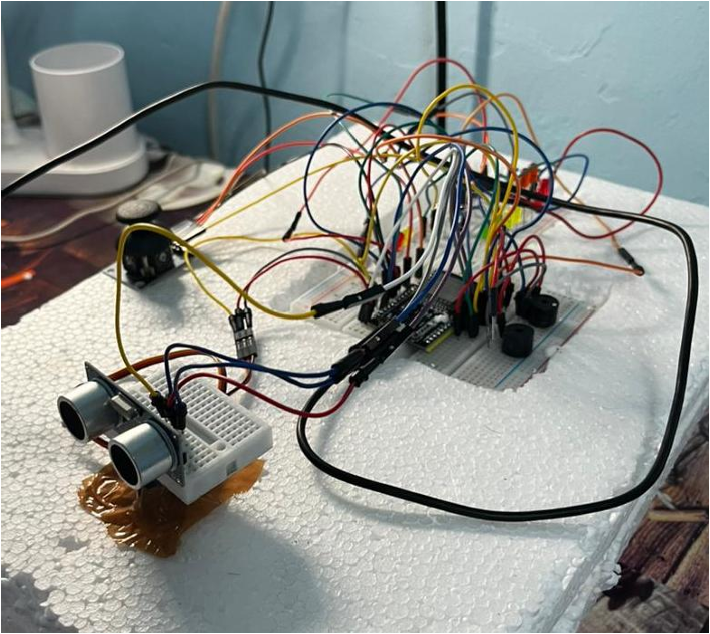
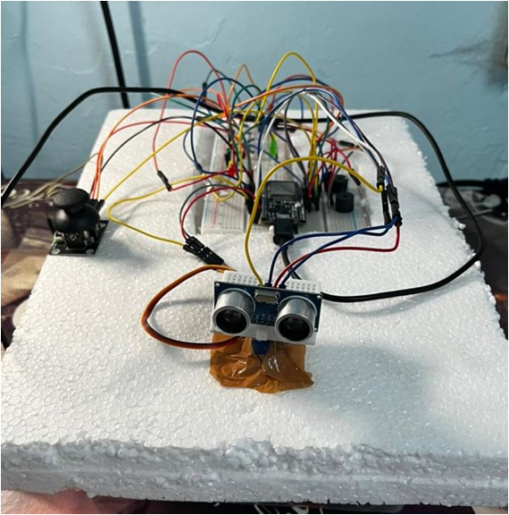
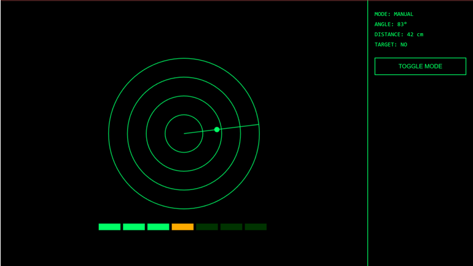
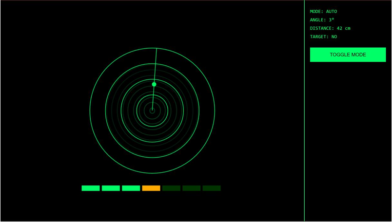
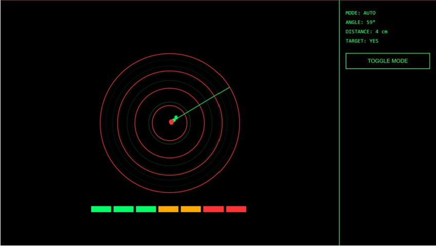
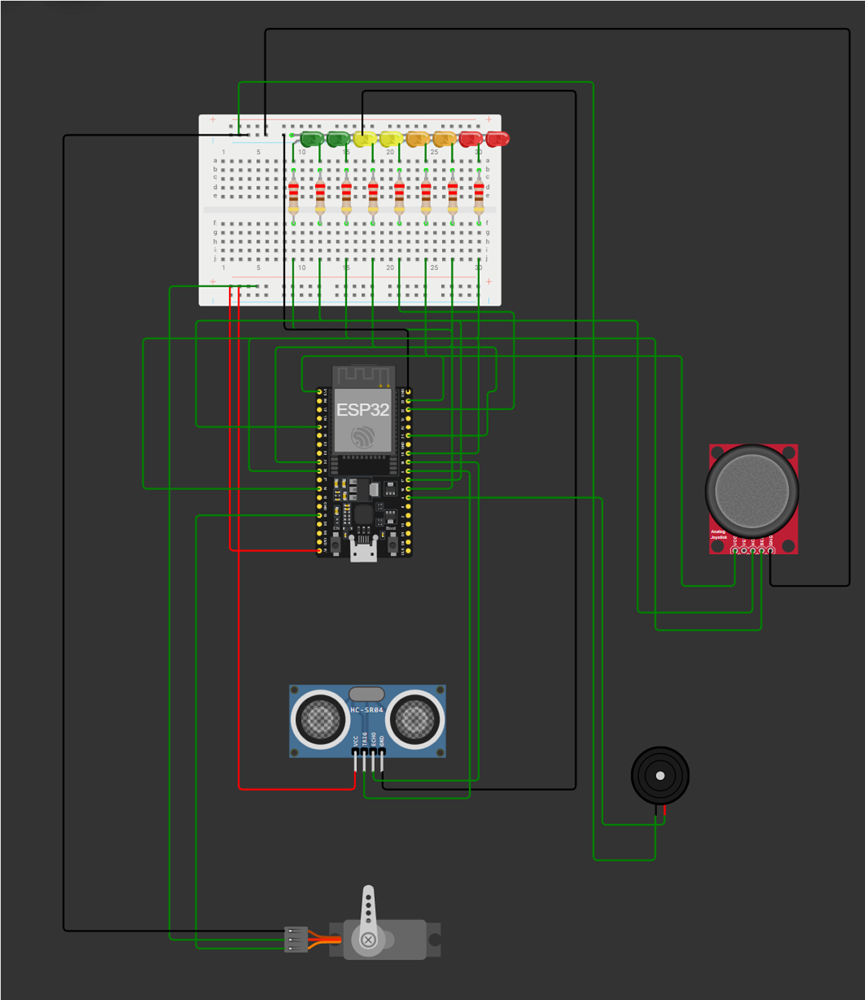

# ESP32 Robot Radar System

An ESP32-powered robotic radar system that performs real-time environmental scanning, object detection, and live radar visualization through a web dashboard.

---

## Overview

This project implements a radar-style robotic scanning system using an ultrasonic sensor mounted on a servo motor.

The system continuously scans the environment from **0° to 180°**, detects nearby objects, and provides multi-layer feedback through LEDs, buzzer alerts, and a live radar dashboard.

When an object enters the detection range, the robot validates the signal and locks onto the target, similar to real radar tracking systems.

---

## Demo

.gif)

https://www.youtube.com/watch?v=6M3X1xsha7I

https://www.youtube.com/watch?v=Nw1-PEBm7XM&feature=youtu.be

## Digital Twin (3D Model)

https://scaniverse.com/scan/qmovmeqbyeedrgni

---

## Hardware Components

- ESP32 microcontroller
- HC-SR04 ultrasonic sensor
- Micro servo motor
- LED proximity ladder
- Piezo buzzer
- Analog joystick
- Push button

---

## Hardware Setup

---

## Tech Stack

### Embedded

- C++
- Arduino Framework
- PWM Servo Control
- State Machine Control
- Non-blocking timing (`millis()`)

### Networking

- ESP32 WiFi SoftAP
- Embedded HTTP Server
- JSON telemetry API

### Web Interface

- HTML
- CSS
- JavaScript
- Canvas API

---

## System Architecture

Input Layer
- Ultrasonic Sensor → Distance measurement
- Joystick → Manual control
- Button → Mode switching

Processing Layer
- ESP32
- Signal validation
- Control logic
- Servo control
- LED mapping
- Buzzer control

Output Layer
- Servo scanning
- LED proximity display
- Buzzer alerts
- Radar web dashboard

---

## Features

- 0°–180° radar sweep
- Autonomous scanning mode
- Manual joystick control
- Object locking mechanism
- Distance-based LED ladder
- Parking-sensor style buzzer alerts
- Real-time radar dashboard
- Live telemetry streaming

---

## Control Logic

The robot operates using a layered decision architecture that processes sensor signals, validates detections, and controls actuation in real time.

The system follows a state-based control flow:

SCAN → DETECT → LOCK → RELEASE

SCAN  
The servo continuously sweeps the ultrasonic sensor from 0°–180°.

DETECT  
Distance measurements are validated to filter noise and false echoes.

LOCK  
If an object remains within the detection threshold for a specified time window, the system locks onto the target and freezes the servo.

RELEASE  
If the object moves outside the release threshold, scanning resumes.

---

## Radar Dashboard

The ESP32 hosts a web interface that visualizes the radar sweep in real time.

Features include:

- animated radar sweep
- echo persistence visualization
- lock indication
- distance telemetry
- synchronized LED ladder

---

## Circuit Diagram

---
## Wiring Connections

| Component          | ESP32 Pin | Description                 |
| ------------------ | --------- | --------------------------- |
| HC-SR04 Trigger    | GPIO 5    | Sends ultrasonic pulse      |
| HC-SR04 Echo       | GPIO 18   | Receives reflected signal   |
| Servo Motor Signal | GPIO 13   | Controls radar sweep motion |
| Buzzer             | GPIO 4    | Audio proximity alert       |
| LED 1              | GPIO 16   | Proximity indicator         |
| LED 2              | GPIO 17   | Proximity indicator         |
| LED 3              | GPIO 19   | Proximity indicator         |
| LED 4              | GPIO 21   | Proximity indicator         |
| LED 5              | GPIO 22   | Proximity indicator         |
| LED 6              | GPIO 23   | Proximity indicator         |
| LED 7              | GPIO 25   | Proximity indicator         |
| Joystick X-Axis    | GPIO 34   | Manual servo angle control  |
| Joystick Button    | GPIO 14   | Mode toggle (AUTO / MANUAL) |

### Power Connections
| Device       | Connection                     |
| ------------ | ------------------------------ |
| HC-SR04 VCC  | 5V                             |
| HC-SR04 GND  | GND                            |
| Servo VCC    | 5V                             |
| Servo GND    | GND                            |
| LEDs         | Through resistors to GPIO pins |
| Buzzer       | GPIO → Buzzer → GND            |
| Joystick VCC | 3.3V                           |
| Joystick GND | GND                            |

## Installation & Setup

### 1. Hardware Connections

Connect the components to the ESP32 as shown in the circuit diagram:

- HC-SR04 ultrasonic sensor
- Micro servo motor
- LED proximity ladder
- Piezo buzzer
- Analog joystick
- Push button

Refer to the wiring diagram: 

---

### 2. Install Arduino IDE

Download and install the Arduino IDE:

https://www.arduino.cc/en/software

---

### 3. Install ESP32 Board Support

1. Open Arduino IDE
2. Go to **File → Preferences**
3. Add the following URL to *Additional Board Manager URLs*:

https://dl.espressif.com/dl/package_esp32_index.json

4. Go to **Tools → Board → Board Manager**
5. Install **ESP32 by Espressif Systems**

---

### 4. Upload Firmware

1. Open the firmware file: https://github.com/adithya-a-labs/esp32-robot-radar-system/blob/main/firmware/robot_radar_firmware.ino
2. Select the correct board: ESP32 Dev Module

3. Connect the ESP32 via USB
4. Click **Upload**

---

### 5. Connect to Radar Dashboard

1. Power the ESP32
2. Connect to the WiFi network created by the ESP32
3. Open a browser and navigate to the dashboard IP

The radar interface will display the live scanning system.

---

## Future Improvements

- LiDAR-based sensing
- ROS integration
- SLAM-based mapping
- autonomous navigation
- machine learning object detection

---

## Documentation

A detailed explanation of the system architecture, control logic, and implementation methodology is available in the full project report: 

---

## Acknowledgements

Developed as part of the Robotics Interest Group induction project.

## Author

Adithya A  
Electronics & Communication Engineering  
NIT Calicut
India

## License

MIT License
